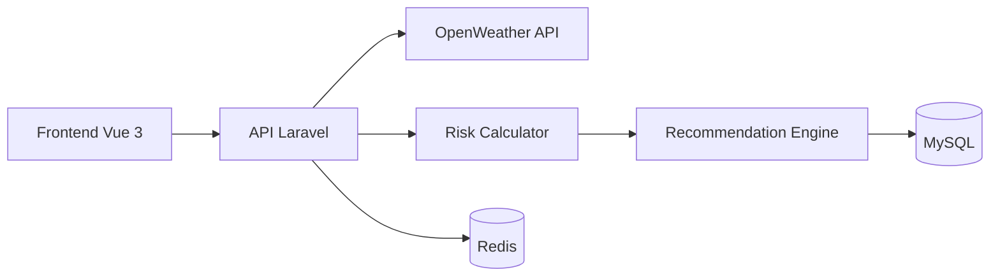
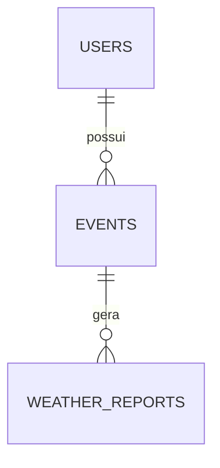

# 🛡️ EventShield

> Plataforma inteligente para monitoramento climático e análise de risco de eventos.

O **EventShield** utiliza previsões meteorológicas para calcular riscos operacionais de eventos e gerar recomendações automáticas que auxiliam organizadores na tomada de decisão.

---

## 📋 Visão Geral

Eventos ao ar livre estão sujeitos a condições climáticas que podem impactar diretamente a segurança, a logística e os custos da operação.

O EventShield analisa dados meteorológicos em tempo real, calcula um **Risk Score** e fornece insights acionáveis para minimizar riscos e evitar prejuízos.

### Principais funcionalidades

* Cadastro e gerenciamento de eventos
* Integração com OpenWeather API
* Cálculo automático de risco climático
* Classificação de risco (Baixo, Moderado e Alto)
* Geração de recomendações automáticas
* Atualização periódica de previsões
* Cache e processamento assíncrono com Redis

---

## 🏗️ Arquitetura



---

## 🚀 Stack Tecnológica

### Backend

* Laravel 12
* PHP 8+
* REST API
* Eloquent ORM

### Frontend

* Vue 3
* Vite

### Infraestrutura

* Docker
* Docker Compose
* MySQL
* Redis

---

## 🎯 Regras de Negócio

### Cálculo de Risco (Outdoor)

| Variável               | Peso |
| ---------------------- | ---: |
| Probabilidade de chuva |  40% |
| Velocidade do vento    |  25% |
| UV / Tempestades       |  20% |
| Umidade / Visibilidade |  15% |

### Classificação

| Score    | Nível       |
| -------- | ----------- |
| 0 - 30   | 🟢 Baixo    |
| 31 - 60  | 🟡 Moderado |
| 61 - 100 | 🔴 Alto     |

---

## 💡 Motor de Recomendações

O sistema gera recomendações automaticamente com base nos dados meteorológicos.

### Exemplo 1

**Risk Score > 40**

> Risco moderado de precipitação. Recomenda-se a contratação de tendas ou coberturas estruturais.

### Exemplo 2

**Velocidade do vento > 50 km/h**

> Rajadas de vento severas detectadas. Evite o uso de banners aéreos e palcos descobertos.

---

## 🗄️ Modelo de Dados



Principais entidades:

* **Users** → Usuários da plataforma
* **Events** → Eventos cadastrados
* **WeatherReports** → Relatórios climáticos e avaliações de risco

---

## 📡 API

### Eventos

```http
POST   /api/v1/events
GET    /api/v1/events
GET    /api/v1/events/{id}
PUT    /api/v1/events/{id}
DELETE /api/v1/events/{id}
```

### Exemplo de Payload

```json
{
  "name": "Festival Tech BH",
  "city": "Belo Horizonte",
  "state": "MG",
  "country": "BRA",
  "latitude": -19.91,
  "longitude": -43.93,
  "event_type": "outdoor",
  "start_at": "2026-08-20T10:00:00"
}
```

---

## 🐳 Executando com Docker

### Subir ambiente

```bash
docker compose up -d
```

### Parar ambiente

```bash
docker compose down
```

### Recriar containers

```bash
docker compose up -d --build
```

---

## ⚙️ Instalação Local

### Backend

```bash
cd backend

composer install

cp .env.example .env

php artisan key:generate

php artisan migrate
```

### Frontend

```bash
cd frontend

npm install

npm run dev
```

---

## 🔑 Variáveis de Ambiente

```env
OPENWEATHER_API_KEY=

DB_HOST=mysql
DB_DATABASE=eventshield
DB_USERNAME=root
DB_PASSWORD=password

REDIS_HOST=redis
```

---

## 🧪 Testes

Executar todos os testes:

```bash
php artisan test
```

Atualizar previsões expiradas:

```bash
php artisan weather:update-expired
```

---

## 📌 Roadmap

* [x] CRUD de Eventos
* [x] Integração OpenWeather
* [x] Motor de Risco
* [x] Motor de Recomendações
* [x] Docker
* [x] Testes Automatizados
* [ ] Dashboard Analítico
* [ ] Notificações
* [ ] Relatórios PDF
* [ ] IA para previsão de riscos

---

## 👨‍💻 Autor

**Moisés Ventura**

GitHub: https://github.com/moisesventurabh

---

## 📄 Licença

Este projeto está licenciado sob a licença MIT.
